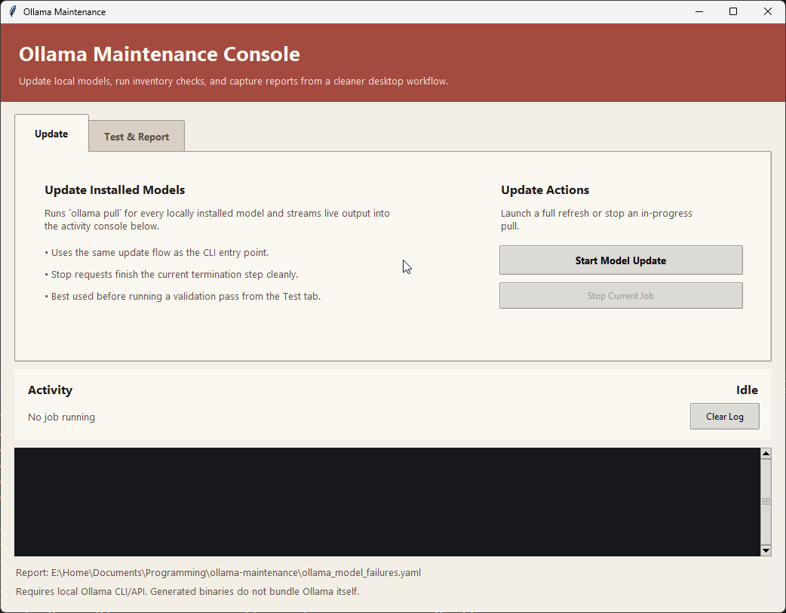
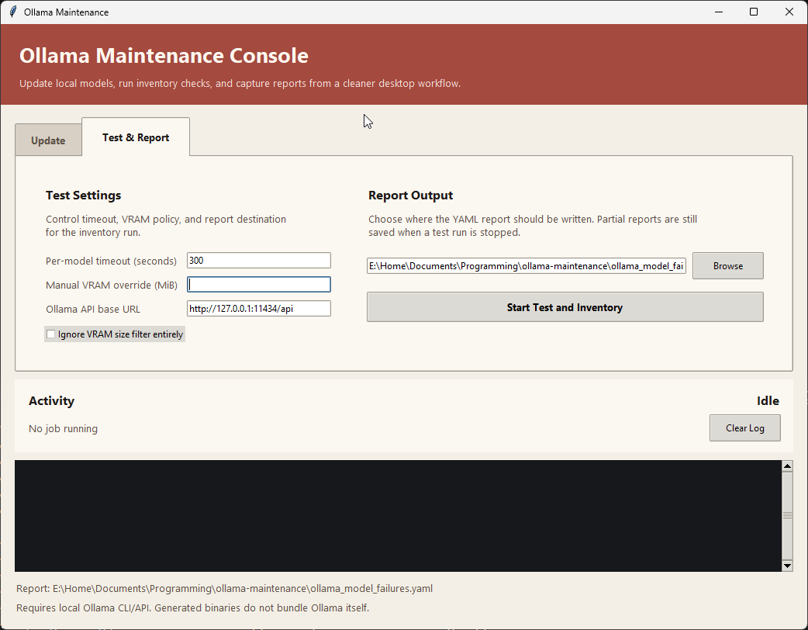

# Ollama Utilities

Small local utilities for maintaining [Ollama](https://ollama.com/) model libraries. The project now includes both CLI tools and a desktop GUI so the same workflows can be used interactively or distributed as standalone binaries.

This repository currently includes:

- `update_ollama_models.py`: updates every locally installed Ollama model with `ollama pull`
- `test_ollama_models.py`: inventories installed models, captures useful metadata, checks whether each model fits device VRAM, and smoke-tests runnable models
- `ollama_maintenance_gui.py`: launches a desktop GUI for running both workflows and reviewing live logs

## What This Repo Is For

This project is designed for people who keep a local library of Ollama models and want a fast way to:

- update all installed models
- see which installed models fit local GPU constraints
- record a concise per-model inventory
- smoke-test models after updates
- preserve a YAML report that is practical to review later

The reporting is intentionally opinionated:

- large low-value internals such as `model_info` are excluded
- verbose tokenizer and tensor-heavy metadata are not stored
- long text fields are reduced to previews instead of being dumped raw

## Screenshots




## Requirements

- Python 3.10+
- [Ollama](https://ollama.com/) installed and available on `PATH`
- a running local Ollama server on `http://127.0.0.1:11434`
- optional: `nvidia-smi` available on `PATH` for VRAM-aware size filtering
- for the source GUI launcher, a Python build that includes `tkinter`

Generated binaries do not bundle Ollama itself. They still require access to a local or remote Ollama installation.

## System Dependencies

This project uses standard-library Python only, but it does depend on external system tools:

- `ollama`
- optional: `nvidia-smi`

If `nvidia-smi` is available, `test_ollama_models.py` measures total GPU VRAM at startup and can filter models against that size. If `nvidia-smi` is unavailable, the script continues without size filtering and records a warning in the YAML report.

## Repository Layout

```text
.
├── src/ollama_maintenance/
│   ├── gui.py
│   ├── test_models.py
│   └── update_models.py
├── .github/workflows/build-release.yml
├── ollama_maintenance_gui.py
├── test_ollama_models.py
├── update_ollama_models.py
├── pyproject.toml
└── README.md
```

## Usage

### Update Installed Models

```bash
python3 update_ollama_models.py
```

Installed entry point:

```bash
ollama-maintenance-update
```

This script:

- reads the installed model list from `ollama list`
- runs `ollama pull` for each model
- prints progress and failures as it goes
- supports clean interruption when launched from the GUI

### Test and Inventory Installed Models

```bash
python3 test_ollama_models.py
```

Installed entry point:

```bash
ollama-maintenance-test
```

Optional examples:

```bash
python3 test_ollama_models.py 600
python3 test_ollama_models.py --ignore-size
python3 test_ollama_models.py 600 --ignore-size
python3 test_ollama_models.py 600 --vram-mib 16384 --report-path custom-report.yaml
python3 test_ollama_models.py 600 --api-base-url http://192.168.1.25:11434
python3 test_ollama_models.py 600 --api-base-url http://192.168.1.25:11434/api
```

Default behavior:

- attempts to measure total device VRAM once at startup using `nvidia-smi`
- skips models whose stored size exceeds startup device VRAM when VRAM detection is available
- fetches concise metadata from the Ollama API
- smoke-tests runnable models with `ollama run`
- retries embedding-style models with sample input when needed
- writes a YAML report to `ollama_model_failures.yaml`

Useful CLI options:

- `--ignore-size`: disables VRAM-based skipping entirely
- `--vram-mib` / `--vram-bytes`: manually override detected VRAM for fit checks
- `--report-path`: write the YAML report somewhere other than the default path
- `--api-base-url`: point the inventory/test workflow at a different Ollama server; accepts either the server root or an explicit `/api` suffix

### Launch the GUI

Run the GUI from source:

```bash
python3 ollama_maintenance_gui.py
```

Installed entry point:

```bash
ollama-maintenance-gui
```

The GUI provides:

- separate `Update` and `Test & Report` tabs
- one-click model updates
- one-click test and inventory runs
- a timeout field and VRAM filter toggle
- an optional manual VRAM override in MiB
- an Ollama API base URL field that defaults to Ollama's local API
- a save dialog and editable path for the YAML report
- a stop button that requests a clean shutdown and preserves a partial test report
- a shared live log pane and activity status area
- a footer note that shows the application version and detected Ollama version when available

GUI notes:

- the Ollama API base URL field is session-scoped and resets to the default on application restart
- the update tab uses the local `ollama` CLI, while the test tab uses the configured Ollama HTTP API base URL for model inventory and metadata calls
- if Ollama is not installed or version detection fails, the footer reports the Ollama version as unavailable

## YAML Report

The generated report includes:

- top-level run settings and summary counts
- warnings, skips, and failures
- one structured record per discovered model

Each model record is split into:

- `overview`: high-signal fields for quick review
- `details`: compact previews of longer text fields
- `runtime`: size-policy outcome plus test attempts/results

Useful fields in the overview include:

- model name
- family and families
- capabilities
- parameter size
- quantization level
- format
- digest
- installed size
- context window when available
- device-VRAM fit status

The report also records the effective API base URL, timeout, VRAM policy, and selected output path for the run.

## Notes and Limitations

- `test_ollama_models.py` depends on the local Ollama HTTP API and the `ollama` CLI.
- `update_ollama_models.py` uses the local `ollama` CLI and does not currently support a custom remote API target.
- `nvidia-smi` is optional. When present, VRAM filtering currently uses the largest `memory.total` value returned by `nvidia-smi`.
- If `nvidia-smi` is unavailable, the script continues without size filtering and records that as a warning.
- The smoke test is intentionally shallow: it is meant to catch obviously broken models, not benchmark quality.
- Some Ollama capabilities are not exposed as stable structured flags for every feature. The report keeps official metadata concise rather than inferring unsupported claims.

## Development

This repo requires only the Python standard library at runtime. There is one optional system dependency for VRAM measurement on NVIDIA hardware.

Quick syntax check:

```bash
python3 -m py_compile \
  update_ollama_models.py \
  test_ollama_models.py \
  ollama_maintenance_gui.py \
  src/ollama_maintenance/*.py
```

## Building Standalone Binaries

Local build:

```bash
python3 -m pip install .[build]
pyinstaller --noconfirm --clean --onefile --windowed --name ollama-maintenance ollama_maintenance_gui.py
```

The generated binary appears under `dist/`.

The binary launches the GUI entry point and is intended for desktop use.

## GitHub Distribution

GitHub Actions now includes [`.github/workflows/build-release.yml`](.github/workflows/build-release.yml), which:

- builds the GUI binary on Windows, macOS, and Linux
- uploads each build as a workflow artifact
- attaches packaged release assets automatically when you push a tag like `v0.2.0`
- verifies that `tkinter` is available in the build environment before packaging

Recommended release flow:

```bash
git tag v0.2.0
git push origin v0.2.0
```

## Public Repo Notes

Before posting results or examples publicly:

- avoid committing generated inventory reports unless you intend to publish local model inventory data
- review model names if they reveal private or regulated workflows
- review licenses and usage terms of any third-party models you have installed
